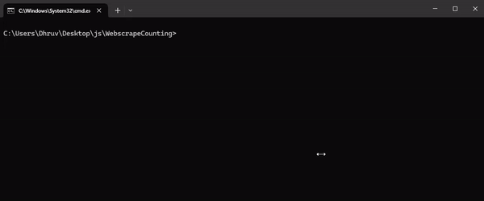

# WebscrapeCounting

Counting by webscraping.

Have you ever wanted to count from 1 to infinity using only text from other websites? \
No? That sounds stupid? Great! I love stupid stuff. \
This repository aims to do just that. This is a community-driven game and you can participate too!

## Installation

```console
$ npm install
$ npx playwright install
$ # Install all the required modules.
$
$ npm run test -- --start=(number) -- --end=(number)
$ # Tests from start (optional) to end (optional).
$ # Ex. npm run test OR npm run test -- --end=4
$
$ npm run start 
$ # ^ Starts the command line interface. 
$ # It's best tested and experienced with the CLI.
$ # There's always a log file in /logs, regardless of where you test it.
```

## Running the CLI

After installation (see above) you can run the CLI by using `npm run start` in the directory.\
Here is a `.gif` of what you should see.

\
[Backup Media Link](https://imgur.com/CJyAFoB)

The CLI should be straightforward and pretty much all you need. There is also a manual way to run this, specified in [Manual Usage](#manual-usage)

## Contributing

You can contribute to this project! All you need to know is how to select some text on a website.\
You can even do it right now! Open up your console `ctrl+shift+j` and slap in this code to get the number of stars

```js
document.querySelector("#repo-stars-counter-star").innerText
```

### Put in your contributions in the [numbers.ts](https://github.com/SuppliedOrange/WebscrapeCounting/blob/main/data/numbers.ts) file

Last but not least, you need to follow this repository's [*golden rules*](#the-golden-rules) before you contribute.

## The Golden Rules

1) You shall not repeat domains. If `google.com` has been used, you cannot re-use it. But you may use `google.co.uk`.
2) The nature of the linked websites must not, to a considerable extent, cater to NSFW content. `Reddit` is fine, `Onlyfans` is not.
3) Your evaluation function must always return a string or a number containing the number.
4) The site must be somewhat reputable and must appear to be concrete. This rule exists because such domains usually disappear shortly or may have harmful content. Additionally, the data you are pulling from must not be volatile.
5) You need to fetch your number or numbers that equate to your number from a place that is visible to the user as text (or is in an element for a similar purpose, visible or not). You may not source numbers or text from class names, tags etc. but you may source them from places like `.innerHTML` and `.innerText` of an element.
6) You shall count in order. If the last number is 14, you may not add anything above 15 until you have added 15 to the numbers list.
7) The scraping must not be based on chance or race conditions. Obviously, this rule is hard to implement, but some sites like chess.com that lazy load and fire the `window load` event before content is rendered must be avoided. It's easy to see what sites cause this by running the scraper a few times.

## Manual Usage

```ts
// example.ts

import { Scraper } from ".";
// Where you import this from might vary. You just need to reference the top-level index.ts file.

import data from "./data/numbers.ts";

( async () => {

    // Create a scraper
    let scraper = new Scraper();

    await scraper.start()

    // Iterate through your data
    for (const scrapeQuery of data) {
        // Try and fetch all the numbers you can.
        try {
            console.log(`Fetching number ${scrapeQuery.number}`)
            await scraper.fetchNumber(scrapeQuery);
            console.log("Success!");
        }
        // When you hit an error, log it.
        catch (e) { console.log(e) }
    }
    
    // Finish
    await scraper.stop();
    console.log("Done!");

})()
```

```console
npx tsx example.ts
```

## Using the in-built logger

```ts
import { Scraper, Logger } from ".";
// Where you import this from might vary. You just need to reference the top-level index.ts file.

import data from "./data/numbers.ts";

async function main() {

    // You may create a logger class if you want to log data.
    let logger = new Logger({
        // The name also defines the file name, unless you provide a custom file path.
        name: "logger",
        // The level is set to "none" by default.
        level: "debug"
    })

    // Create the scraper class.
    let scraper = new Scraper({
        // You can choose to give your scraper a name.
        name: "myscraper",
        // Attach a logger if you want logs distributed in the same channel.
        logger: logger
    })

    await scraper.start()

    // Iterate through your data
    for (const scrapeQuery of data) {

        try {
            // Scrape each number
            console.log(`Scraping number ${scrapeQuery.number}`);
            await scraper.fetchNumber( scrapeQuery );
            console.log("Success!");
        }
        catch (error) {
            // If there's an error while trying to scrape a number, log it.
            console.log(error)
        }

    }

    await scraper.stop()

    console.log("Done!");
    console.log(`Logs are stored in ${logger.filePath}`)
    
}

main();

```

```console
npx tsx example.ts
```
